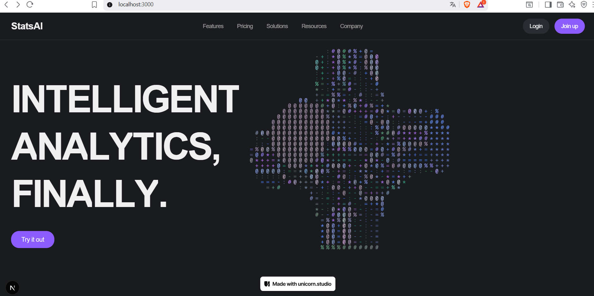
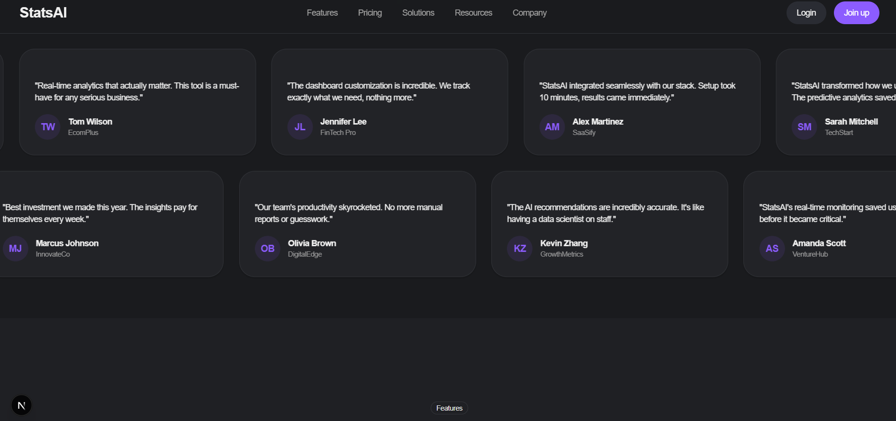
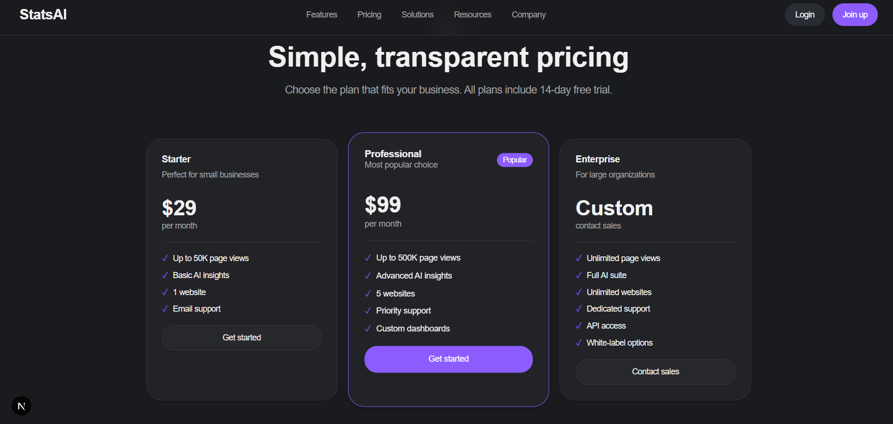

# StatsAI

An AI-powered analytics platform landing page built with Next.js 15, featuring modern animations and a responsive design.


# App Demo




## Features

- **Animated Hero Section** - GSAP-powered character-by-character headline animation
- **Interactive Background** - Integrated Unicorn Studio interactive background element
- **Testimonial Marquee** - Dual-row infinite scroll testimonials with scroll-triggered animations
- **Responsive Design** - Fully responsive layout optimized for all screen sizes
- **Modern UI Components** - Built with Radix UI and custom Tailwind components
- **Dark Mode Ready** - Full theme support via CSS variables

## Tech Stack

- **Framework**: [Next.js 15.5.4](https://nextjs.org/) with Turbopack
- **Runtime**: React 19.1.0
- **Styling**: [Tailwind CSS 4](https://tailwindcss.com/)
- **Animations**: [GSAP 3.13](https://greensock.com/gsap/) with ScrollTrigger
- **UI Components**:
  - [Radix UI](https://www.radix-ui.com/) (Avatar, Separator, Slot)
  - Custom shadcn/ui components
- **Icons**: [Lucide React](https://lucide.dev/)
- **TypeScript**: Full type safety with TypeScript 5


## Getting Started

### Prerequisites

- Node.js 20+
- npm or yarn package manager

### Installation

1. Clone the repository:
```bash
git clone https://github.com/SonnyHardy/Statsai.git
cd statsai
```

2. Install dependencies:
```bash
npm install
```

3. Run the development server:
```bash
npm run dev
```

4. Open [http://localhost:3000](http://localhost:3000) in your browser.

## Available Scripts

- `npm run dev` - Start development server with Turbopack
- `npm run build` - Build production application with Turbopack
- `npm start` - Start production server
- `npm run lint` - Run ESLint

## Key Components

### AnimatedHeadline (`src/components/animated-headline.tsx`)
GSAP-powered component that animates headline text character by character with stagger effects. Uses `power4.out` easing for smooth entrance animations.

### TestimonialMarquee (`src/components/testimonial-marquee.tsx`)
Features two rows of testimonial cards with infinite horizontal scrolling in opposite directions. Implements scroll-triggered fade-in animations using GSAP ScrollTrigger.

### Main Page (`src/app/page.tsx`)
Complete landing page structure including:
- Fixed navigation bar with blur backdrop
- Hero section with Unicorn Studio integration
- Features grid (6 feature cards)
- Pricing section (3 pricing tiers)
- CTA sections
- Footer with link groups

## Styling

The project uses Tailwind CSS 4 with custom CSS variables for theming. Color tokens and design system are defined in `src/app/globals.css` using CSS custom properties for easy theme customization.

## Third-Party Integrations

- **Unicorn Studio**: Interactive background element loaded via CDN script (v1.4.32)
- Project ID: `Zy9a85VDQtZzVbXdGH55`
